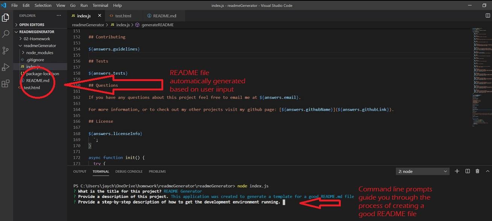

# My Project

## Description 

This application was created to generate a template for a good README.md file. The application runs using node.js and generates a README file based on user input using the command line. The file is generated complete with a table of contents linked to each section. The application also gives the option of which type of license to choose for the project and allows the user to choose guidelines for contributing to the project. This README file template was created using this application.

## Table of Contents

* [Installation](#installation)
* [Usage](#usage)
* [Contributing](#Contributing)
* [Tests](#Tests)
* [Questions](#Questions)
* [License](#license)

## Installation

To install this application you must be running node.js and requires these node packages: inquirer, fs, and util.

1. Install node.js - instructions for installing node.js can be found here: https://nodejs.org/en/
2. Open the command prompt and navigate to your working folder.
3. Run npm install to install required node modules. More detailed instructions can be found here: https://www.npmjs.com/package/npm-install
4. Once the modules are installed you can run the js file using node by typing `node yourFilename.js`
5. Answer the questions when prompted.
6. Your README file will be automatically generated in the same directory that where your js file is located.

## Usage

Follow the command prompts to create a good README file. [Check out this video for a demonstration of how the applicaton works](https://youtu.be/O1diJB13y6w)

## Contributing

This project is not accepting contributions at this time. However if your application does want to accept contributions you can use the default option of the [The Contributor Covenant Code of Conduct](https://www.contributor-covenant.org/version/2/0/code_of_conduct/). Alternatively you can also use custom guidelines.

## Tests

There were no written tests performed on this application but it has been tested many times in both node.js and using the command prompt.

## Questions

If you have any questions about this project feel free to email me at jaychap77@yahoo.com. 

For more information, or to check out my other projects visit my github page: [jaychapman](https://github.com/jaychapman).

## License

[The MIT License](https://opensource.org/licenses/MIT)
  
